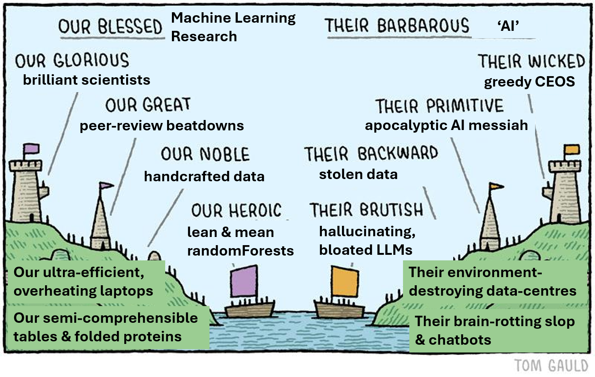
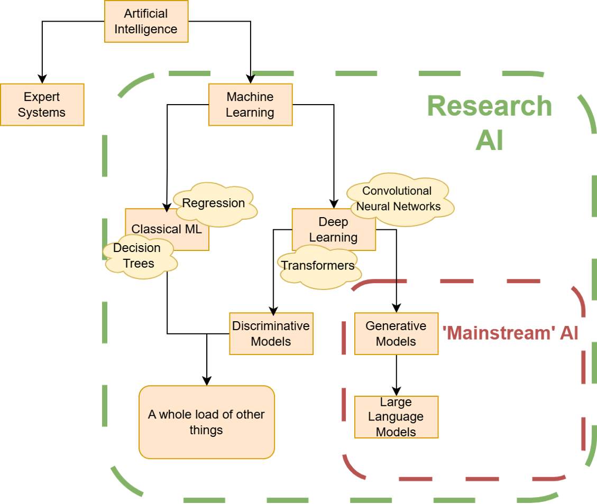

*A plain-language guide to what "AI" actually means, how it is used in the life sciences, what the main criticisms are, and what to watch out for if you want to use it in your own research. The picture above is a caricature, but it captures a real and growing split between **popular AI** and **research ML**, and that split is the thread running through this document.*

**Who this is for:** biologists. You are assumed to be comfortable with university-level biology and statistics-adjacent ideas (a *t*-test, a PCA plot, a phylogenetic tree), but **no programming knowledge is needed**. Where a technical term appears for the first time it is explained, and there is a short [glossary](#glossary) at the end.

This is a write-up of a talk given on 8th of October 2026. You can also access our [slides & a recording](https://uoe-my.sharepoint.com/:f:/r/personal/achalka_ed_ac_uk/Documents/0.DRPHCB-AI%20Bioinformatician/Workshops-Presentations-Talks/2026-10-08%20An%20Overview%20of%20AI%20in%20Biology?d=wc2fb4342063e4445b420b89729acee7a&csf=1&web=1&e=7jdABR).

------------------------------------------------------------------------

## At a glance

- **"AI" is an umbrella term**, not a single technology. Chatbots, protein-structure predictors, self-driving cars and a random forest classifying bacterial isolates are all called "AI", but they have very little in common.
- **Most of what makes headlines is one small corner of the field**: large language models (LLMs) such as ChatGPT, Claude and Gemini. Most AI *in biology research* is something else: smaller, task-specific **machine learning** models trained on open scientific data.
- **Machine learning (ML) means learning rules from data** instead of having an expert write the rules by hand. It is statistics plus algorithms, not magic, intelligence or consciousness.
- ML comes in two main **learning styles** (supervised and unsupervised) and two main **families of algorithm** (classical ML and deep learning). Knowing which of each you need is most of the battle.
- The big public criticisms of AI (energy use, stolen training data, cognitive decay) are mostly about *popular* AI. They apply to research ML in a different, usually milder, form, but research ML has its **own pitfalls**: biased data, overfitting, confusing correlation with causation, and poor reproducibility.

# Part 1: What is AI? {#part-1-what-is-ai}

## 1.1 One word, many meanings

Ask a room of people whether they have heard of any of the following and most will say yes to all of them:

> ChatGPT · AlphaFold · machine learning · an autonomous car · Skynet · Stable Diffusion · random forest · Siri

All of these get filed under "AI", yet "AI" is used in at least four different ways:

| "AI" as… | What people mean |
|------------------------------------|------------------------------------|
| **A cultural term** | Science-fiction robots, utopian and dystopian futures |
| **A research field** | A branch of computer science dating back to the 1950s |
| **A shorthand for generative AI / LLMs** | Anything that produces text or images on request |
| **A marketing term** | "Now with AI!", added to products to attract attention |

Much of the heated public discussion about AI is people arguing about *different subfields under the same umbrella*. It is a bit like arguing about whether "the microbiome" is healthy when one person means gut bacteria and another means soil fungi. Untangling the vocabulary comes first, and the easiest way to do that is to see where the field came from.

## 1.2 A short history

| Period | What happened | Why it matters |
|------------------------|------------------------|------------------------|
| **Antiquity** | Myths of artificial beings: automata, golems, mechanical servants | The *idea* is ancient, but it was fiction |
| **1940s–1950s** | Alongside new ideas in neurobiology, researchers began to think of the brain as a kind of "neurological machine" that could be replicated. A mathematical model of the neuron appeared in 1943, and the term "artificial intelligence" was coined at a workshop at Dartmouth in 1956 | The modern field begins here |
| **1970s–1980s** | **Expert systems**: experts write down rules, the computer follows them. A famous biomedical example is MYCIN, which recommended antibiotics for bacterial infections | Works for narrow, well-defined problems, but is brittle and limited (see below) |
| **1980s–1990s** | **Machine learning** (the term dates from 1959) gathers momentum as a subfield: give the computer data and statistical algorithms and let it work out the rules itself | A direct answer to the limits of expert systems, but computationally prohibitive at the time |
| **2000s** | Computing power increases exponentially, and "big data" arrives (the web, social media and, in biology, high-throughput sequencing) | A **machine-learning boom**. |
| **2010s** | **Deep learning** (a subfield of ML) takes off, helped by GPUs (graphics chips that happen to be excellent at the maths involved). Deep learning in turn leads to **generative AI** and then LLMs. The *transformer* architecture appears in 2017 | Models keep improving as you feed them more data |
| **2020s** | GPT-3 (2020); AlphaFold 2 solves much of the protein-folding prediction problem (2020–21); ChatGPT launches publicly in late 2022; the 2024 Nobel Prizes recognise both AlphaFold and neural-network research | We're here |

### Why expert systems ran out of road

Expert systems were "top-down": an expert defines the rules and the machine follows them blindly. If you want a car to drive on a road, give it the entire Highway Code and it should obey.

The problem is that things that feel intuitive to humans are astonishingly hard to write down as rules. **Try describing a cat in such analytical detail that an alien reading your instructions could pick one out of a line-up without ever confusing it with a dog.** Whatever rules you write, there will be a cat that breaks them. Biologists will recognise the same problem from writing species keys: the more variable the organisms, the faster a rigid set of rules breaks down.

Machine learning flips the approach around. Instead of writing the rules, you show the computer many examples and let it find the rules, then you check whether the rules it found are any good.

## 1.3 Demystifying "AI"

So what *is* AI? Is it magic? Is it intelligent? Is it conscious?

**No. It is statistics, big data and pre-defined methods called algorithms.**

- An **algorithm** is a fixed recipe: a defined sequence of steps.
- A **model** is what you get when an algorithm has been run on data. It is the set of learned rules that turns an input into an output. What those rules look like depends on the algorithm: for a decision tree they are the yes/no splits, while for a neural network they are millions or billions of numbers called *parameters*.

The old and new approaches differ in where the rules come from:

|   | **Expert systems (old, top-down)** | **Machine learning (new, bottom-up)** |
|------------------------|------------------------|------------------------|
| Who writes the rules? | A human expert | The algorithm, from the data it is given |
| Ingredients | Rules + data → answers | Data (+ known answers) + algorithm → **rules** |
| The rules then… | …are applied to new data | …are applied to new data to produce predictions |

If you remember one sentence from this section, make it this one: **in machine learning, input data and an algorithm create the rules, and the rules determine the output.**

## 1.4 A (very rough) family tree of AI

Anyone who has built a phylogeny knows the difficulty: the tree you get depends on which characters you choose. AI has the same problem. You could divide the field by *how it learns*, *what it outputs*, *what data it uses*, and so on. The field is also young and moving fast, so categories overlap and the terminology is fuzzy. The tree below is therefore **incomplete and approximate**, but it is a good map for getting started.



The key observation is that **"mainstream" AI occupies a small corner of a much larger field**. Most of the branches above (and most of the AI used in biology) never make the news.

## 1.5 Classical machine learning

### How does a machine learn the rules?

There are many algorithms, and many ways of categorising them. Broadly, they fall into two families:

- **Classical machine learning**: traditional statistical algorithms, in use since roughly the 1990s (regression is much older) and still very much alive. Typically used on smaller datasets.
- **Deep learning**: neural networks, loosely inspired by the brain. Better suited to large, complex datasets. (See [section 1.7](#17-deep-learning).)

### A plain-language tour of common algorithms

| Algorithm | In plain language | A biological use |
|------------------------|------------------------|------------------------|
| **Linear regression** | Fit a straight-line relationship between inputs and a number | Standard curves; predicting a trait from covariates |
| **Logistic regression** | As above, but predicts a yes/no outcome as a probability | Resistant vs. susceptible; disease vs. healthy |
| **Decision tree** | A flowchart of yes/no questions: "Is gene A present? If yes, is gene B present?…" Essentially a **dichotomous key** | Classifying isolates by presence/absence of genes |
| **Random forest** | Hundreds of decision trees that each "vote"; the majority wins | Genotype → phenotype prediction; microbiome classification |
| **Support vector machine (SVM)** | Finds the boundary that best separates two groups | Classifying tumour subtypes from expression data |
| **Clustering** (e.g. k-means, hierarchical) | Groups similar samples together without being told the groups | Cell types in single-cell data; patient subgroups |
| **PCA** | Compresses many variables into a few informative axes | Population structure in genotype data |
| **Bayesian models** | Update a prior belief using the observed data | Many phylogenetic and population-genetic methods |

Decision trees are worth singling out, because they are the building block of many popular classical algorithms (random forests, gradient boosting). Picture a starting point, a yes/no question, another yes/no question, and a decision at the end. Each individual block is very simple.

### Strengths and limits

Classical ML is simple *compared with the rest of the field*, not simple in absolute terms. Its main attractions are:

- **Interpretable.** You can trace back how a decision was made and ask whether the rules make biological sense, or whether you have built something nonsensical.
- **Cheap.** Classical models are far less resource-intensive to train and test. A recently published bacteriophage-host prediction model was trained in about six hours on a 2019 laptop. You do not need a supercomputer.

Its weakness is **scale and complexity**. As relationships get more complicated and data grows, classical models tend to plateau: past a certain point, feeding them more data barely helps (diminishing returns). A complex problem like predicting a protein's 3D structure from its sequence is beyond what classical methods can handle well.

### Worked example: antimicrobial resistance (AMR)

Bacteria can be resistant to antibiotics, and we want to know which genes confer that resistance. A machine-learning framing looks like this:

|   | What it is | In the AMR example |
|------------------------|------------------------|------------------------|
| **Input** (called *features*) | The data you start with | Genotype: which resistance genes or mutations each isolate carries, plus metadata such as species |
| **Output** (called the *label* or target) | What you want to predict | Phenotype: the minimum inhibitory concentration (MIC), or simply resistant / susceptible |

**To train a model you need both**: a set of isolates for which you know the genotype *and* the measured phenotype. The algorithm learns the link between the two. Once trained, you give the model a new isolate's genotype and it predicts the phenotype, and the model can be built in either direction.

Many published studies do exactly this, but that **even a "solved" problem leaves room for new work**: you can use different datasets, different methods, or look at the problem from a different angle.

### Generalising: from genotype → phenotype to any x → y

Nothing about this recipe is specific to bacteria or resistance. If you can describe your problem as "I have measurements **x** and I want to predict outcome **y**", and you have matched examples of both, you can build a model. Plant biologists use it to predict whether a rose petal will be white or red from genes and environment. Other examples cited in the talk:

- **Protein function** predicted from amino-acid sequence alone
- **SNP discovery**
- **Crop yield prediction**, which uses not just experimental data but also weather and other environmental features
- **Source attribution of foodborne bacteria**: given a *Salmonella* genome, which animal, region or host did it likely come from?
- **Host prediction for viruses**: matching metagenome-derived viruses of archaea and bacteria to their hosts
- **Plant genotype-to-phenotype prediction**

### What if you don't have y?

Sometimes you have only **x**: lots of data, but no labelled outcome. **You can still use ML**, for example to ask whether your samples fall into natural groups.

An example is discovering patient clusters from genetic signatures, and analysing population structure.

## 1.6 Supervised vs. unsupervised learning

Most of classical ML can be sorted into two learning styles:

|   | **Supervised learning** | **Unsupervised learning** |
|------------------------|------------------------|------------------------|
| **Goal** | **Predict a value** from structured, labelled data | **Find structure**: classify or split unlabelled data |
| **You need** | Inputs *and* known outputs (x and y) | Inputs only (x) |
| **Typical question** | "Given this genome, will the isolate be resistant?" | "Do these samples cluster together? Is there population structure I didn't know about?" |
| **How it works** | Train on labelled data, then test on data the model has not seen | Algorithm looks for patterns on its own |

> **Rule of thumb:** if you can already say what you want to predict, you probably need supervised learning. If you first want to *look* for structure, start with unsupervised.

> **Beyond the two:** these are the main styles, not the only ones. *Self-supervised learning* (a common label for the "unsupervised" training of LLMs and protein language models such as ESM) creates its own labels from the data, for example by hiding a word or amino acid and asking the model to predict it. *Reinforcement learning* trains a model by trial and error against a reward signal, and is one of the steps used to tune chatbots to follow human preferences. *Semi-supervised learning* mixes a little labelled data with a lot of unlabelled data.

### Where ML is used across biology

If you can frame your problem as data in, answer out, ML can probably be applied to it. Some representative areas:

| Area | Example tasks |
|------------------------------------|------------------------------------|
| **Proteomics and metabolomics** | Protein function, protein family, conservation, folding; metabolic networks. Input can be amino-acid or DNA sequence |
| **Genomics** | Gene expression analysis; SNP identification; gene calling and annotation (many tools now use ML) |
| **Systems biology** | Network modelling; predicting cell–cell interactions |
| **Agriculture and applied biology** | Crop yield prediction; pest management; disease prediction |
| **Medicine** | Cancer diagnosis and subtyping; personalised treatment |
| **Ecology and environmental biology** | Climate-impact modelling; species distribution models |

### Applying this to your own research

Two questions get you started:

1.  **What data do I have, and what do I want to get out of it?** That decides between supervised and unsupervised approaches (or a mixture of both).
2.  **Does a tool already exist?** Search the literature with keywords like "machine learning" or "deep learning" plus your topic. If nothing suits you, you can build a model yourself using one of the approaches above.

------------------------------------------------------------------------

## 1.7 Deep learning

Everything said so far about supervised vs. unsupervised learning, building models and applying them to biology **also applies to deep learning**. Deep learning is a different way of *building* the model, not a different kind of task. Instead of decision trees or regression, deep learning uses **neural networks**.

### What is a neural network?

A neural network is a highly simplified, loosely brain-inspired structure: layers of interconnected "neurons", each of which takes in numbers, combines them and passes a result on. The layers are:

```         
 Input layer  →  Hidden layer(s)  →  Output layer
 (your data)     (the "thinking")    (the prediction)
```

The more hidden layers, the *deeper* the network, and **deep learning** is the practice of using networks with many, many layers.

When a network is trained, every connection has a number attached, called a **weight** (more generally, a *parameter*), which controls how strongly one neuron influences the next. Training starts from a blank canvas and gradually nudges each weight up or down until the network's predictions become good. You can think of the weights as being like the fitted coefficients in a regression, except that there are millions or billions of them rather than a handful. The trained collection of weights *is* the model, and this is what people mean by "open-weight" models later on.

### Why deep learning is called a "black box"

Compare how a decision tree and a neural network handle the same inputs (say the presence or absence of genes A, B and C):

- **Decision tree:** "Is gene A present? Yes → is gene B present? No → predict *susceptible*." You can read the logic back and judge whether it makes biological sense.
- **Neural network:** "Take the value of gene A, multiply it by 5; because B is present, take a square root of the result; add 42…" and so on across dozens of layers. Why those particular operations? *They simply work.* It is extremely hard to derive any biological meaning from the arithmetic.

This is why deep learning is described as a **black box**. The data is "encoded" in ways that are incomprehensible to us. That makes deep learning **excellent when you care about the result and less appealing when you care about the underlying logic**. If a model predicts a protein's structure accurately, you may not care how it did it. If it predicts which gene causes resistance, you probably do.

### Deep learning is ideal for large data and complex relationships

Deep learning really shines where classical ML plateaus. Prominent biological examples include:

- **AlphaFold**: predicts a folded 3D protein structure from an amino-acid sequence.
- **ESM**: "protein language models" trained on hundreds of millions of protein sequences (the 2021 paper used 250 million), from which information about biological structure and function emerges.
- **DeepVariant**: a Google tool that detects genetic variants (SNPs and small indels) in sequencing data.

Different network *architectures* suit different kinds of biological data:

| Architecture | Suited to | Biological example |
|------------------------|------------------------|------------------------|
| **Multilayer perceptron** (the basic network) | Tabular inputs | Predicting toxicity from a molecule's properties |
| **Convolutional neural network (CNN)** | Images and image-like data | Microscopy images; DeepVariant treats sequencing reads as images |
| **Recurrent network / transformer** | Sequences, where order matters | DNA sequence → transcription-factor binding; protein sequences; text |
| **Graph neural network** | Networks and relationships | Protein–protein interaction networks; molecular structures |
| **Autoencoder** | Compressing data into a compact "latent representation" | Learning a compact encoding of protein sequences |

## 1.8 Discriminative vs. generative models

There is another useful way to divide models: by what they learn about the data.

- **Discriminative models** learn the **decision boundary between classes**: "is this a cat or a dog?"
- **Generative models** learn the **distribution of the inputs themselves**: "what does a cat look like?"

Generative models are, first and foremost, a way of modelling and sampling from the data itself, and they are not limited to deep learning (the profile hidden Markov models behind tools like HMMER are generative models too). a reason why we care about generation is data quality. To train a good model you need a **representative dataset**, encoded in a way that preserves the relationships between its parts. You would not train a model of tomato yield on data about peas. And if you build a disease model using data from only one part of the population, the model will not work well for everyone else.

But how do you know whether your dataset and encoding are any good? One heuristic is to **ask the model to generate new data** based on what it has learned:

- If the generated output is **comprehensible and plausible**, the input data and encoding were probably good.
- If the output is **incomprehensible**, go back to the drawing board.

This is a more demanding demonstration of learning, just as it is harder to *draw or describe* a cat than to *recognise* one.

Generative AI grew from this idea, and it is now used in biology too: designing new proteins, generating candidate drug-like molecules, and DNA/protein "language models" that can write plausible new sequences. In practice the boundary between the two categories is blurry, which is a reminder that the family tree in [section 1.4](#14-a-very-rough-family-tree-of-ai) is a guide, not a rulebook.

## 1.9 Large language models (LLMs)

Language is just another type of data, so why not apply the generative approach to it? The field of **natural language processing** builds models that can perform operations on language. Assemble an enormous, representative language dataset (books, forum posts, websites, recipes, whatever is available), train a generative deep-learning model on it, and you have a **large language model**.

The architecture that defined the early LLMs is the **Generative Pre-trained Transformer (GPT)**:

| Letter | Meaning |
|------------------------------------|------------------------------------|
| **G**enerative | It can create new text |
| **P**re-trained | It is first trained on a very large existing body of text |
| **T**ransformer | The type of neural network used, which is good at sequential data, where order matters (words in a paragraph, or residues in a protein) |

Put together, you get tools like ChatGPT. (Newer models have more complicated architectures, but transformers remain the core.)

**What made LLMs take off** was a surprise: they turned out to be unexpectedly good at *following instructions*. They did not just continue a paragraph with something plausible. You could ask one to "rephrase this more formally", "summarise this" or "collate these points", and it would. Later training stages, including fine-tuning on human feedback, made this much stronger. That ability is what allowed LLMs to be commercialised in so many products.

**The catch: hallucination is inherent.** An LLM is optimised to produce *plausible* text, not *accurate* text. At bottom it is a very sophisticated next-word predictor, with no built-in mechanism for checking whether what it says is true. (Whether that amounts to anything like understanding is debated, but the practical lesson is not.) This means LLMs will happily produce:

- references that do not exist,
- confident but wrong statements about a gene or pathway,
- protocols that read well but are subtly wrong.

Treat an LLM as a fluent first-draft generator, **never as a database or a source of record**, and verify anything that matters.

## 1.10 Two worlds: mainstream AI vs. research ML

Step back and the picture is clear. **"Mainstream" AI equals LLMs and their generative cousins.** They are defined by enormous datasets, enormous models, enormous compute, commercial deployment, and a generalist approach.

That can be intimidating if you want to use AI in your research ("do I need a data centre?"). The answer is **no**. Research-scale ML looks very different:

|   | **Mainstream AI (LLMs)** | **Research-scale ML** |
|------------------------|------------------------|------------------------|
| **Data** | Enormous, scraped at scale | Typically smaller and often **open datasets** |
| **Models** | Enormous | Smaller overall |
| **Compute** | Large data centres | A workstation or a share of an HPC (high-performance computing) cluster |
| **Purpose** | Commercial, **generalist** | **Task-specific**, trained around a scientific question |

### Quick quiz: where do popular tools sit?

| Tool | What it does | Where it falls |
|------------------------|------------------------|------------------------|
| ChatGPT, Claude, Gemini, Microsoft Copilot | Chatbots that generate text | **LLMs** (mainstream, closed-source) |
| DeepSeek, Qwen, Gemma | Chatbots that generate text | **LLM** (open-weight, see Part 2) |
| Stable Diffusion | Creates images from text prompts | **Generative model** (images) |
| ElevenLabs | Produces synthetic voices (and more) | **Generative model** (audio) |
| DeepL | Translates text between languages | Language-model-based translation, a close cousin of LLMs |
| AlphaFold | Amino-acid sequence → folded protein | **Deep learning** (research) |
| DeepVariant | Detects SNPs in sequencing data | **Deep learning** (research) |
| ESM | Protein language models | **Deep learning** (research), a transformer trained on hundreds of millions of sequences |

The mainstream tools dominate the conversation, so it is easy to get a skewed picture. Many of the "hot" research papers are indeed about deep learning, but **the vast majority of the studies mentioned in Part 1 use classical machine learning and discriminative models**. These are small-scale, quiet and specialised, so they are hard to discuss individually.

------------------------------------------------------------------------

# Part 2: AI usage and its criticisms {#part-2-ai-usage-and-its-criticisms}

## 2.1 The mood

Public opinion on AI ranges from optimism to pessimism. Remember that in popular discourse "AI" is usually shorthand for **LLMs**. The debate is also tangled up with the economy, geopolitics and a wider sentiments with the tech industry, so supporters and critics often express sentiments about *Big Tech as a whole* rather than about the technology itself.

To keep things manageable, here are three commonly cited **benefits** and the **criticism** that goes with each:

| Benefit | The matching criticism |
|------------------------------------|------------------------------------|
| **Automating tedious tasks** | …but it is **energy-intensive**, even for seemingly trivial jobs |
| **Lowering technical barriers and democratising knowledge** (for example, helping a non-programmer write a short script or command-line command) | …but that knowledge came from models **trained on stolen / copyrighted data** |
| **A sounding board** for brainstorming and drafting | …but it can **make you stupid** ("cognitive decay") |

This leads to two questions that structure the rest of this part:

1.  **How can LLMs be used ethically**, as a user, and are there "more ethical" models?
2.  **Do these criticisms apply to machine-learning research?** And if not, what are the *other* pitfalls?

> **Closed vs. open models.** Tools like ChatGPT, Claude and Gemini are **closed-source**: you use them through a browser or an API (a programmatic connection), and you **cannot download the model or run it yourself**. Everything you type goes to the company's servers. Most of the public debate is about these closed models, and the distinction matters for data privacy and energy use, as we'll see.

## 2.2 Energy usage

- LLMs are **computationally intensive**, and therefore energy-hungry. "Frontier" (newest, most capable) models need specialist, high-end servers both to *train* and to *run*. Closed frontier models cannot be downloaded at all, and even the largest open-weights models need server-grade hardware rather than a laptop or a high-end gaming PC.
- **Efficiency gains are real**: newer models and training methods use less energy per query, and some labs, notably several Chinese ones such as DeepSeek, have made efficiency a selling point. Novel data-centre designs, including offshore and wind-powered ones, are being trialled.
- **But gains are offset by rising demand.** Even if each query costs less, more people making more queries means total energy use keeps climbing. (Economists call this the *Jevons paradox*.)
- **Demand is subsidised.** Users generally do not pay the "true" cost of a query, which encourages casual use.

Does that mean we should never use these tools? New technologies are often clunkier and more power-hungry in their early years. A more useful approach is to weigh **comparison and necessity**: *is there a better or cheaper way to do this, and how much value does this task produce?* Consider whether any of the following justifies the energy:

- Outputting a simple bash (command-line) command
- Summarising an email
- Turning a bullet-point list into a formal academic draft
- Using it as a sounding board
- Writing a small Python script

There is no single right answer, and it depends partly on whether you are a technical or non-technical user. If you could do a task with your eyes closed, the energy cost is hard to justify. If it would otherwise take hours of struggle and the tool helps you learn, it may be more defensible. **The question to ask is: what is the resource cost of this task relative to the value it produces?**

## 2.3 "Trained on stolen / copyrighted data"

**Short answer: yes.** Large language models were trained on vast amounts of copyrighted material, including pirated books.

**Longer answer:** in a prominent 2025 US ruling (*Bartz v. Anthropic*), a district court held that training on *lawfully acquired* books was "fair use", but that downloading and keeping *pirated copies* was not. The case then settled for a reported \$1.5 billion, so the ruling was never tested on appeal and is not settled law. Many other lawsuits across text, image and music generators are ongoing, and courts have not all reached the same conclusions, so the legal picture may change. And it is precisely this ethically dubious data that gives LLMs their breadth of knowledge.

Related issues scientists should be aware of:

- **Your conversations may be used to refine the model.** With commercial LLMs, whatever you type may be used for further training. Think carefully about what data you give them: **unpublished results, patient-identifiable or clinical data, and confidential or collaborator data should not be pasted into closed commercial tools** unless your institution has approved the specific service. Check your institutional policy and the tool's data settings.
- **Human labour is still needed for data annotation.** Models are improved by people rating their outputs. Annotators with scarce expert skills in wealthy countries can be paid well; in the developing world the pay is often very low for very similar work, and the content can be distressing. This raises the question: **what level of labour exploitation is tolerable?**

None of this is unique to AI. Phones, for example, are built using minerals mined under exploitative conditions. The point is not that the technology is inherently bad, but that **it tends to exacerbate existing faults in society**, particularly in labour relations and politics. Commercial profit motives make it worse.

## 2.4 "It makes you stupid" (cognitive decay)

**To an extent, yes.** The brain operates on a "use it or lose it" basis. The helpful comparison is a **calculator**: most of us would reach for one to multiply 12 × 23, but if the calculator broke, we could still work it out on paper, just slower. The test for using an LLM is the same: *if it broke, could I still reason my way through this?*

The effect depends on **what mental process you are offloading**:

| Example prompt | What you are offloading | How helpful? |
|------------------------|------------------------|------------------------|
| "Write an essay on X" | The whole task: framing, structure *and* thinking | Least helpful. You retain almost nothing, and the result is generic |
| "Brainstorm five approaches to X, taking Y and Z into account" (with your own reasoning written out for the model) | Idea generation only. You supply the framing and judge the results | More helpful. You stay in the driving seat |
| "Create a paragraph from these bullet points" | Wording, not ideas | Reasonable, as long as you critically edit the result |
| "Make this draft more formal" | Polish and register | Reasonable. Compare against the original and decide what to keep |
| "Fix my prepositions please, I barely passed my English grammar tests" | A language skill you may want to build yourself | Fine as a one-off; if it becomes a habit, you never improve |

Two further points:

- **Developing brains are affected more.** This is why there is extra controversy about children and teenagers using LLMs: it is the stage when skills are being built, and just as children are taught to do sums by hand before being handed a calculator, offloading too early may stunt them.
- **Scientific research on the long-term effects is still in its infancy**, and early studies are small, so treat headline claims in either direction with caution.

Whatever you use an LLM for, **critically examine the output**, both to avoid putting nonsense in your work and to keep your own skills intact.

## 2.5 Open and local LLMs: a more ethical approach?

If closed commercial models are the problem, are there alternatives? Yes, though with caveats. First, some definitions. They are often confused:

| Term | What you get | Notes |
|------------------------|------------------------|------------------------|
| **Closed-source** | Access through a browser or API only | ChatGPT, Claude, Gemini, Copilot. You cannot download or inspect the model |
| **Open-weights** | The model's **parameters** only (essentially "the model file") | The **most common** form of "open" model. You can download and run it, but may not have the training data or the full training code. Examples: Qwen, DeepSeek, Mistral (France), Llama, Gemma |
| **Open-source** | The training **code, data and parameters** | Genuinely rare. Fully open examples exist (e.g. OLMo from the Allen Institute for AI) |
| **Local** | Runs **on your own machine**, fully private and offline | Not a licensing term but a way of *using* an open-weights model |

Open-weights models come in many shapes and sizes. Some can be inspected to a degree, they offer more transparency than closed ones, and their use has been rising. That is positive, because it hands users more control.

### Do they fix the three criticisms?

| Criticism | Open / local LLMs |
|------------------------------------|------------------------------------|
| **Energy usage** | Usually **smaller and more efficient**, partly because they are born out of constraint: developers without huge budgets or unable to buy the newest chips, so they are forced to be efficient. "Large" versions still need specialist servers; others run on a laptop or even a smartphone. You can host locally (cheap, and you pay your own electricity bill directly) or on a private cloud machine (more expensive, but you still pay the cost) |
| **Stolen data** | **It depends, and it is mostly unknown.** The training data for open-weights models is often not disclosed. Developers of some open-weights models have also been accused by frontier labs of "stealing" from frontier models by training on their outputs, an accusation that some observers find ironic given the criticisms of how the frontier models themselves were trained |
| **Cognitive decay** | Open models tend to be **less capable** (depending on size), so you often have to write a more careful prompt and check the answer more critically. Paradoxically, this forces more attention and may help a little |

**Verdict:** open and local models are not a panacea, but they are a good alternative. They shift some control back to the user, particularly over **privacy** (nothing leaves your machine) and **energy**.

### How to get started

- [**Edinburgh University's ELM service**](https://elm.edina.ac.uk/elm) provides secure access to several LLMs, including open-weights models (such as Qwen 3.5), on university servers, with guidance and usage tips.
- [**LM Studio**](https://lmstudio.ai/): a beginner-friendly desktop app for downloading and running local LLMs on your own computer. It can also connect to paid cloud models if you want.
- **Communities and repositories**: [**Hugging Face**](https://huggingface.co/) (a repository of models, datasets and more) and the [**r/LocalLLaMA**](https://www.reddit.com/r/LocalLLaMA/) & [**r/LocalLLM**](https://www.reddit.com/r/LocalLLM/) subreddit (tools, tips, discussion on running models locally).
- Personal favourite: [**whatisit-nl2sh**](https://github.com/ThorOdinson246/whatisit-nl2sh): a small model that turns a plain-English request ("how do I find a file on this server?") into a bash command and can run on lightweight and older machines.

## 2.6 Do these criticisms apply to research ML?

**Mostly not**, or at least not in the same way. Research ML models are niche, small, and built under constraints.

| Criticism | In research ML |
|------------------------------------|------------------------------------|
| **Energy** | Depends. **Classical ML** needs far less computing power than **deep learning**. Even deep-learning researchers are limited by data, funding and hardware, so the same "born out of constraint" selection effect applies. Work is usually done locally or on existing bioinformatics servers |
| **Stolen / copyrighted data** | Data must be **available, ethically sourced and, for clinical data, appropriately secured**. If you do not disclose what you trained on, you will struggle to publish: reviewers, journals, funders and public-health bodies will ask where your data came from |
| **Cognitive decay** | The same logic applies: *could you determine a protein's function just by reading its amino-acid sequence?* Probably not, so you should be able to critically examine a model's results and ask whether they make sense. Clinical models must pass **quality and oversight checks** like any other tool, and are typically used as **human-in-the-loop** systems with continuing human oversight |

------------------------------------------------------------------------

# Part 3: Pitfalls of machine learning in research {#part-3-pitfalls-of-machine-learning-in-research}

So, is all well with research ML? **No.** Without the mainstream controversies it still has plenty of ways to go wrong.

Most criticisms stem from one basic fact: **ML models are bias-replicating machines.** Whatever you feed in is what you get out.

## 3.1 The main issues

### Bias replication: "garbage in, garbage out"

> *Do I have a large, representative dataset?*

If the training data is skewed (a single lineage, one hospital, one demographic group, one lab's protocol), the model will inherit that skew. You may get a model that performs badly, or one that looks deceptively good.

### Overfitting and poor generalisability

A model that has memorised noise in the training data will score brilliantly on that data but poorly on anything new. This is **overfitting**, and the result is **poor generalisability**: it does not work "in the wild". A useful picture comes from fitting a curve to scattered points:

|   | **Underfit** | **Optimum** | **Overfit** |
|------------------|------------------|------------------|------------------|
| **The model is…** | Too simple; misses the real pattern | Captures the real pattern | So flexible it traces every wobble, including noise |
| **Training error** | High | Low | Very low |
| **Test error** | High | Low | **High** |

An overfit model is the machine-learning equivalent of drawing a 12th-order polynomial through a dose–response curve: it hits every point and predicts nothing.

### Correlation is not causation

> *Are the model's rules based on biologically important factors?*

When a model uses certain genes or features to make decisions, you do **not** know that they are biologically causative. A classic trap in bacterial genomics is that closely related isolates share both their genes *and* their phenotypes, so a model may learn **lineage** rather than **mechanism**. The same goes for batch effects and other confounders. Follow up with experiments and be careful about how you filter and select your data.

### Reproducibility

This is not unique to ML, but it matters a great deal in bioinformatics. Store your data properly, make your code available, and make it easy for yourself and others to re-run your models, replicate your approach and improve on it.

### High technical skills required

ML research is multidisciplinary, and it demands programming, statistics *and* biology. Common rookie mistakes include:

- not testing the model properly before publishing (no held-out test data, no cross-validation),
- fitting it to meaningless data because the biology wasn't understood,
- not understanding the statistics behind the method.

Most biologists will find the statistics and programming harder than the biology, and computational scientists will find the reverse.

### Overcomplicating, or overestimating

> *Am I overcomplicating my approach?* You do not need a 70-billion-parameter neural network to identify cell shape.
>
> *Am I overestimating ML's capabilities?* You are not going to cure cancer with a small random forest.

Match the method to the problem. Start simple, and add complexity only when it is justified.

## 3.2 How to avoid these issues

The short answer is that you should not try to do it entirely alone; the longer answer is a practical checklist:

1.  **Define the question and the data first.** What is x, what is y, and is y actually reliable?
2.  **Check your data is representative.** Who or what is missing? Are there batches, lineages, sites or demographics that could confound the result?
3.  **Start with a simple baseline** (such as logistic regression or a random forest) before reaching for deep learning. Always compare your model against it.
4.  **Hold out test data that the model never sees**, and use **cross-validation**. Where samples are related (same patient, same lineage, same batch), split by *group* so related samples don't leak between training and test sets.
5.  **Pick metrics that fit the problem.** With rare outcomes, "accuracy" can be misleading: a model that always predicts "susceptible" can be 95% accurate if 95% of isolates are susceptible. Look at precision, recall and similar measures.
6.  **Interrogate what the model learned.** Use feature-importance tools, and ask whether the important features make biological sense.
7.  **Validate biologically**, with independent datasets or experiments, not just the same data again.
8.  **Document and share** your data, code and settings.
9.  **Get help.** Involve a collaborator or a bioinformatics core early, ideally *before* you generate the data.

------------------------------------------------------------------------

# Part 4: Summary and key takeaways {#part-4-summary-and-key-takeaways}

After reading this overview you should be able to:

- **Distinguish between** "AI", LLMs, generative AI and machine learning.
- Recognise that **LLMs are over-represented** commercially and in popular discourse, whereas **machine learning is steadily growing, but more quietly and in niches**.
- Describe roughly **how a machine-learning model is built**, and the difference between **supervised and unsupervised** methods. In practice: *do I have labelled data, or do I need to cluster first?*
- Know the **common criticisms** of AI (energy, data and labour, cognitive decay), the **open / local LLMs** that offer an alternative, and the **pitfalls and technical skills** needed for good ML research.

------------------------------------------------------------------------

# Part 5: Getting started and resources {#part-5-getting-started-and-resources}

## 5.1 A suggested learning path

1.  **The command line (Bash).** Most bioinformatics and ML tools are run from here, and it is the foundation for everything else.
2.  **A programming language.** **Python** has the largest ML ecosystem; **R** is also well supported and may feel more familiar if you already use it for statistics.
3.  **A machine-learning framework.** A framework is a toolbox that provides ready-made building blocks for models. In Python, *scikit-learn* covers classical ML and *PyTorch* (or TensorFlow) covers deep learning.
4.  **ML theory and practice.** Plenty of free guides exist online, but be careful: some are themselves AI-generated and contain errors. The **StatQuest** YouTube channel is a well-regarded starting point, with clear diagrams explaining the most popular ML algorithms.

## 5.2 Training and support from the Discovery Research Platform

The **Discovery Research Platform for Hidden Cell Biology (DRP-HCB)** hosts a bioinformatics core that includes a dedicated AI bioinformatician. Support includes:

- **Training**
  - Upcoming [*Machine Learning with Python*(live session](bioinformatics_live.html)): build "a nifty little model" on your own laptop.
  - Existing Unix command-line (Bash) workshops, with Python courses and further ML modules in development.
- **Consultation for projects**: advice, and links to further resources, whether you want to collaborate on building a model or just want to know whether ML is the right tool.
- **Contact:** achalka\@ed.ac.uk · shaun.webb\@ed.ac.uk

------------------------------------------------------------------------

# Glossary {#glossary}

| Term | Meaning |
|------------------------------------|------------------------------------|
| **Algorithm** | A fixed, step-by-step recipe for performing a calculation |
| **Artificial intelligence (AI)** | Umbrella term for computer systems that perform tasks associated with intelligence. Also used loosely to mean LLMs, or as a marketing label |
| **Black box** | A model whose internal logic cannot easily be interpreted by humans |
| **Classical machine learning** | Traditional statistical ML algorithms (regression, decision trees, random forests, SVMs, clustering…) |
| **Cross-validation** | Repeatedly splitting your data into training and test portions to check how well a model generalises |
| **Deep learning** | ML using neural networks with many layers |
| **Discriminative model** | A model that learns the boundary between classes ("cat or dog?") |
| **Expert system** | Older approach to AI in which humans hand-write the rules |
| **Feature** | An input variable used by a model (for example, presence of a gene) |
| **Generative model** | A model that learns the distribution of its data and can create new, similar data |
| **GPT** | Generative Pre-trained Transformer, the architecture behind many LLMs |
| **Hallucination** | A fluent but false output from an LLM |
| **Label / target** | The known outcome a supervised model is trained to predict (for example, resistant / susceptible) |
| **Large language model (LLM)** | A generative deep-learning model trained on huge text datasets (ChatGPT, Claude, Gemini…) |
| **Machine learning (ML)** | Algorithms that learn rules from data instead of being given them |
| **Model** | The learned rules (parameters) that turn an input into a prediction |
| **Neural network** | A layered network of simple units whose connection weights are tuned during training |
| **Open-weights / open-source / local** | See [section 2.5](#25-open-and-local-llms-a-more-ethical-approach) |
| **Overfitting** | A model that fits its training data (including noise) too closely and fails on new data |
| **Parameter / weight** | A number inside a model that is adjusted during training |
| **Supervised learning** | Learning from labelled examples to predict an outcome |
| **Transformer** | A neural-network architecture suited to sequential data (text, DNA, proteins) |
| **Unsupervised learning** | Finding structure (clusters, patterns) in unlabelled data |
