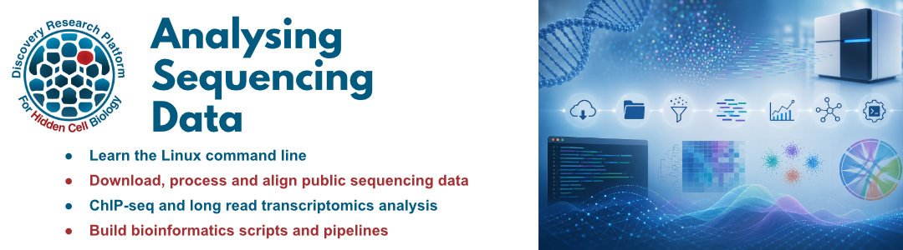
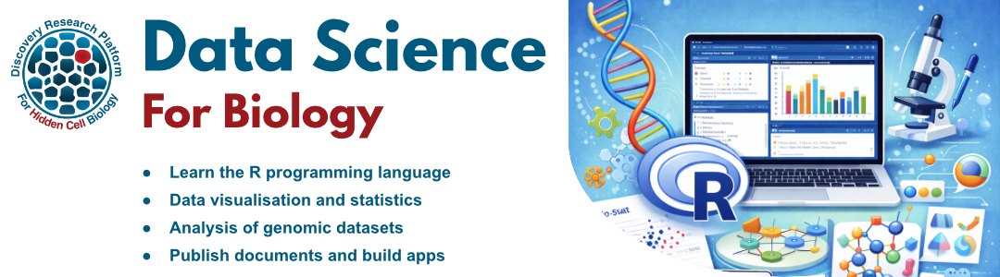

## Analysing sequencing data (2026)

Learn to analyse high throughput sequencing (HTS) data with the Linux command line. This course introduces popular tools, file formats and workflows for processing HTS datasets.

A **laptop computer** is required for this course.

The course is divided into five modules. Participants can register for the full course or individual modules.

- Bioinformatics on the Linux command line - 8th September
- High throughput sequencing data - 29th September
- HTS data analysis (ChIP-seq) - 27th October
- Long read transcriptomics - 24th November
- Building bioinformatics pipelines - 8th December

Each module consists of:

- A full day in person workshop
- Online training material for self study
- Monthly bioinformatics clinics for further advice

#### Cost

- All modules: **£200**
- Individual modules: **£50**

#### Registration

Please complete this registration form to sign up for the course or individual modules:\
[Analysing Sequencing Data Form]()

This course is hosted by The Bioinformatics Core at the Discovery Research Platform for Hidden Cell Biology (DRP-HCB).

Contact [shaun.webb\@ed.ac.uk](mailto:shaun.webb@ed.ac.uk) for more information.

#### Modules

**Bioinformatics on the Linux command line**\
Tuesday 8th September, 10am - 4pm\
JCMB 4325C, Kings Buildings

Gain hands-on experience using the Linux command line and working in a terminal environment. In this course, you will learn to run command line tools and interact with bioinformatics software and data. 

- Navigate the Linux file system
- Learn Linux commands to manage and interact with files
- Run command line bioinformatics tools
- Install software with [Conda](https://docs.conda.io/projects/conda/en/latest/user-guide/getting-started.html)

**High throughput sequencing data**\
Tuesday 29th September, 10am - 4pm\
JCMB 1512, Kings Buildings

Get to grips with sequencing data and file formats. Navigate online sequencing data repositories to identify publicly available datasets. Download, explore and assess sequencing data for further analysis.

- Search and download data from public repositories ([ENA](https://www.ebi.ac.uk/ena/browser/home), [GEO](https://www.ncbi.nlm.nih.gov/geo/), [SRA](https://www.ncbi.nlm.nih.gov/sra))
- Understand HTS file formats
- Perform quality control and assess sequencing data for analysis
- Explore reference sequence databases  ([Ensembl](https://www.ensembl.org/),[NCBI](https://www.ncbi.nlm.nih.gov/))

**HTS data analysis (ChIP-seq)**\
Tuesday 27th October, 9am - 3pm\
JCMB 1206C, Kings Buildings

Perform a complete analysis of a sequencing dataset, from raw data to publication ready images. This workshop uses a short-read ChIP-seq dataset as an example, but many of the steps and tools are applicable to other technologies.

- Download public data
- Run quality control tools
- Map reads to a reference genome
- Visualise aligned data on a genome browser
- Downstream ChIP-seq analysis e.g. peak calling, motif analysis

**Long read transcriptomics**\
Tuesday 24th November, 9am - 3pm\
JCMB 1206C, Kings Buildings

This workshop covers analysis of long-read transcriptomic data in both model and non-model organisms. Learn to assemble transcripts, identify and annotate genes, and perform basic transcriptome analysis.

- Assemble transcriptomes with long reads (with and without a reference genome)
- Identify and annotate (novel) genes and transcript isoforms
- Transcript quantification and analysis

**Building bioinformatics pipelines**\
Tuesday 8th December, 10am - 4pm\
JCMB 4325C, Kings Buildings

Reproducibility is a corner stone of robust bioinformatics analysis. In this workshop, you will learn to build flexible, reproducible and automated bioinformatics pipelines using bash scripts and Snakemake.

- Command line scripting with [Bash](https://www.w3schools.com/bash/bash_script.php)
- Programmable, reusable pipelines
- Introduction to the [Snakemake](https://snakemake.readthedocs.io/en/stable/) workflow management system

## Data Science for Biology (2026)

Learn data science skills with biological datasets. This course introduces the R programming language. R is an extremely powerful tool for data science, statistical analysis and data visualisation. It is favoured by biologists due to its extensive library of packages for bioinformatics and genomic analysis.

The Data Science for Biology course is divided into six modules. Participants can register for the full course or individual modules.

- Introduction to R and RStudio - 17th February
- Data manipulation and visualisation (Tidyverse) - 17th March
- Genomic datasets in R (Bioconductor) - 21st April
- Introduction to statistics (RStatix) - 12th May
- Differential expression analysis (DESeq2) - 9th June
- Data publication and presentation (Quarto and Shiny) - 23rd June

Each module consists of:

- A full day in person workshop
- Online training material for self study
- A practical exercise that can be tailored to your own data
- Access to monthly bioinformatics drop in sessions

#### Cost

- All modules: **£200**
- Individual modules: **£50** 

#### Registration

Please complete this registration form to sign up for the course or individual modules:\
[Data Science for Biology Registration Form](https://forms.office.com/e/hx73VvSAJs)

This course is hosted by The Bioinformatics Core at the Discovery Research Platform for Hidden Cell Biology (DRP-HCB).

Contact [shaun.webb\@ed.ac.uk](mailto:shaun.webb@ed.ac.uk) for more information.

#### Modules

**Introduction to R and RStudio**\
17th February, 10am - 4pm\
Rowan teaching room, The Nucleus, Kings Buildings

Learn the basics of the [R programming language](https://www.r-project.org/) and the [RStudio](https://posit.co/products/open-source/rstudio/) programming environment.

- Install R, RStudio and packages
- Use the RStudio interface
- Basic R syntax
- Data types and structures
- Importing and exporting data
- Plots and statistics with base R

**Data manipulation and visualisation (Tidyverse)**\
17th March, 10am - 4pm\
JCMB 3211, Kings Buildings

The [*Tidyverse*](https://tidyverse.org/) is a collection of R packages designed for data science and the preferred utilities for many R users. This module introduces the core Tidyverse packages for data manipulation and visualisation.

- Introduction to the Tidyverse packages (tidyr, readr, dplyr, ggplot2)
- Work with large datasets
- Import, format, filter and summarise tables of data
- Create publication ready visualisations

**Genomic datasets in R (Bioconductor packages)**\
21st April, 10am - 4pm\
Rowan teaching room, The Nucleus, Kings Buildings

[Bioconductor](https://www.bioconductor.org/) is a collection of R packages specifically designed for analysing genomic datasets. This module introduces some of the core Bioconductor packages and data formats for working with biological data.

- Bioconductor overview
- Importing and exporting genomic data
- Operations on genomic datasets
- Plotting genomic data

**Introduction to Statistics (RStatix)**\
12th May, 10am - 4pm\
JCMB 4325, Kings Buildings

An introduction to statistical analysis in R using the [RStatix](https://rpkgs.datanovia.com/rstatix/) package. This module covers common statistical tests and how to apply them to biological datasets.

- Data exploration and visualisation
- Common statistical tests (t-test, ANOVA, chi-squared test)
- Assumptions and diagnostics
- Post-hoc testing and multiple testing correction

**Differential expression analysis (DESeq2)**\
9th June, 10am - 4pm\
JCMB 3212, Kings Buildings

Perform a full differential expression analysis of RNA-seq data using the [DESeq2](https://bioconductor.posit.co/packages/3.19/bioc/html/DESeq2.html) Bioconductor package.

- Data import and quality control
- Normalisation and transformation
- Differential expression testing
- Visualisation and interpretation of results
- Downstream analysis (pathway analysis, gene ontology)

**Data publication and presentation (Quarto and Shiny)**\
23rd June, 10am - 4pm\
JCMB 3212, Kings Buildings

Learn how to build reproducible analyses and present your results as web pages and interactive applications.

- Project version control with [git](https://git-scm.com/) and [GitHub](https://github.com/)
- Package management with [renv](https://rstudio.github.io/renv/)
- Create reproducible documents and websites with [Quarto](https://quarto.org/)
- Build interactive data visualisations with [Shiny](https://shiny.posit.co/)

## Bioinformatics Clinics

Monthly drop-in sessions to get help with bioinformatics analysis and training exercises.

Upcoming dates:

- Friday 18th September 2026, 15:00 - 16:00, Swann 7.14, Kings Buildings

## Bioinformatics Live

Regular live demonstration sessions covering a variety of bioinformatics tools.

- Friday 18th September 2026, 14:00 - 15:00, Swann 7.14, Kings Buildings

See the [Bioinformatics Live](bioinformatics_live.html) page for more details and upcoming sessions.
